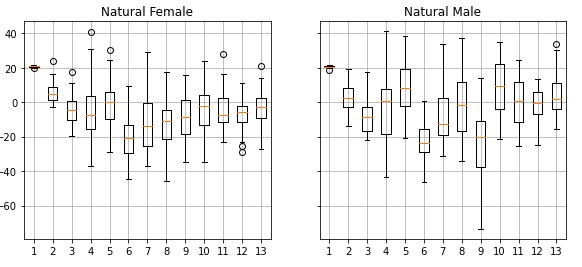
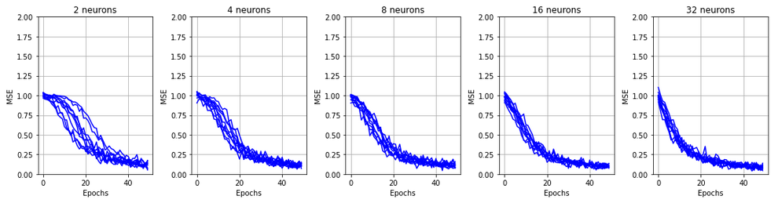
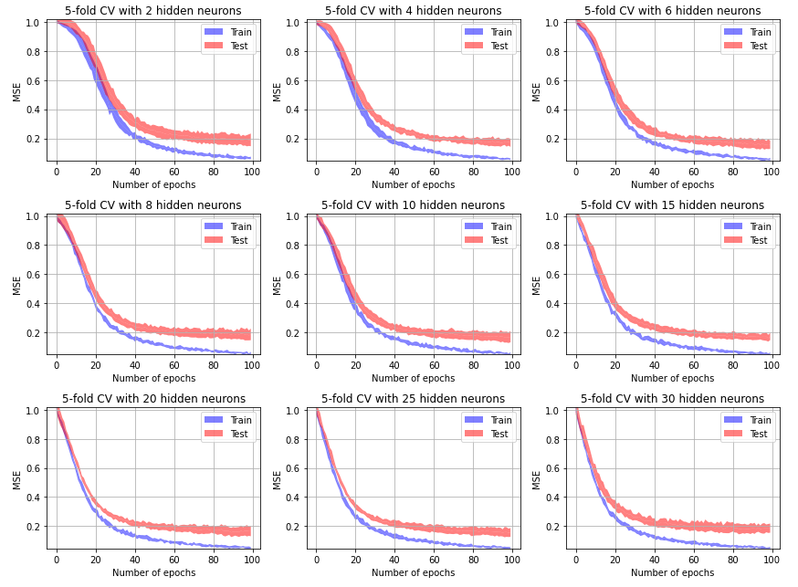
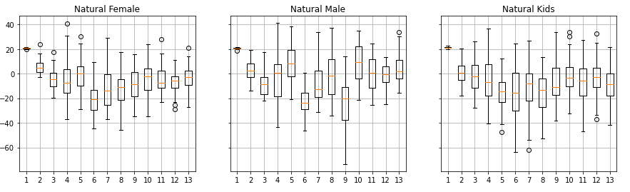
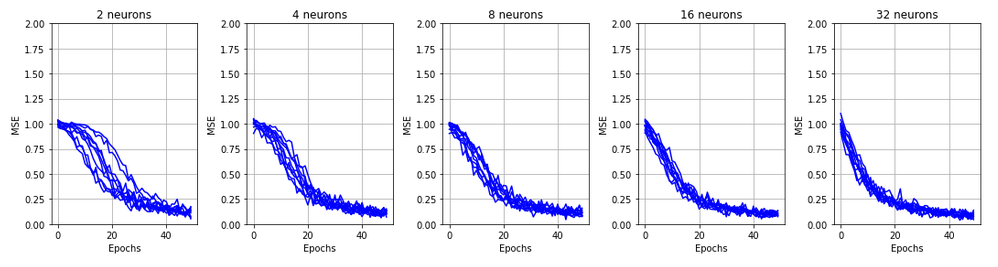
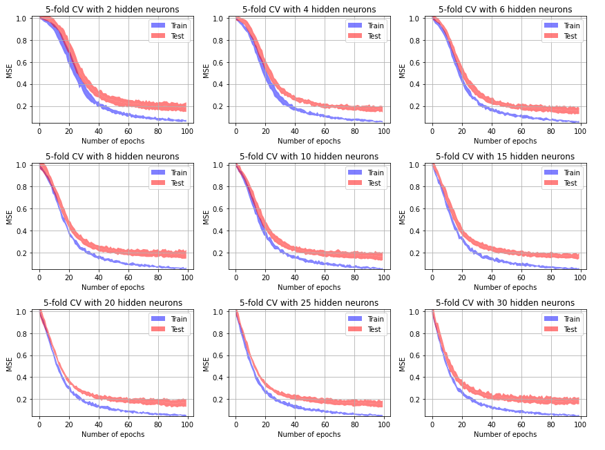
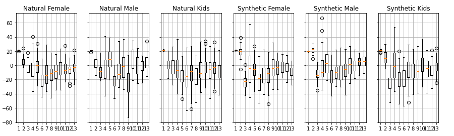
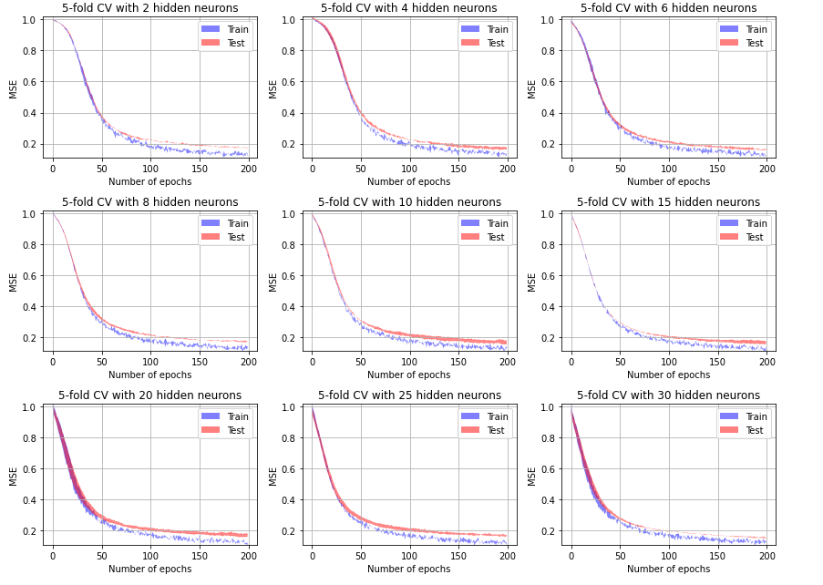

---
title: "ARN - Laboratory 03"

author: 
- Anthony Coke
- Guilain Mbayo
- Mehdi Salhi
date : \today
titlepage: true
logo: figures/logo.png
toc: true
toc-own-page: true
...
 
# Introduction

# Man vs Woman
The purpose of this experiment was to train our model to be able to
differentiate between men and women.

> The associated notebook for this experiment is 'MaleFemale-model_selection.ipynb'

## Number of observations
Our dataset consist of audio samples of vowels pronounced by men and women.
For this part, we have treated 36 values for each class (men and women).
We then computed 13 MFCCs for each sample.

## Features to train the model
As we can see on the precedent diagram, there are some mfccs that are better than
other to classify our dataset. For exemple, the mfcc number 9 is quiet different between 
male and female voices. However, we can see as well that some of their values are overlapping.
As none of the mfccs seemed sufficient in itself or in combination with some other, we chose
to use the whole dataset in order to get classification as accurate as possible.

## Procedure for model selection
The very first step after getting the dataset is to normalize and label it.
We chose to use the tanh function for this part, as it was easy for two classes to put the value 1 for the first and -1 for the second.
As tanh output value between minus one and plus one, we got better learning curves than with sigmoïdal, which give an output between zero and one.
Then, in order to choose the best parameters for our model, we tried at first the basis value of 0.001 for the learning rate, 0.5 for the momentum and 50 epochs. 
After observing the results, we adjusted our parameters. Those steps where repeated several times in order to narrow our results.
When we obtained a satisfying curve for the training and test sets, we generated the confusion matrix to verify that our datas were indeed well classified.

## Description of the final model and performance evaluation
Our final model used the following hyper-parameters: 

- tanh activation function
- learning rate of 0.0009
- momentum of 0.9
- 2 hidden neurons
- one output neuron
- number of epochs:  of 100
- threshold at 0.0.

Results :

- MSE on train set : 0.059
- MSE on test set : 0.178. 

Our confusion matrix was 

[35. 1.] 

[1. 35.]

We measured the performances of our model by using a 5-fold cross-validation.

{width=50%}

We can see that our model has a good ability to generalize. Our final choice
would be to use 2 or 4 neurons because the MSE result for the test set does not spread too
much and it follows the train set accurately. Also, having a small number of neurons 
avoids the risk of overfitting and is a simple enough model.

We also computed the following scores to confirm the performances of our model:

- Accuracy :  0.97
- F1-Score: 0.97

## Comments
We had a problem with data normalizations. At first, we normalized the female and male dataset
separately, which produced a curious error. We needed to give output value between 0 and 1
instead of -1 and 1 for the tanh validation function in order to get acceptables MSE curves 
for both training and test sets. This problem has been fixed by merging both dataset before 
the normalization, which is of course the correct way to normalize a dataset.

# Man vs Woman vs Children

The purpose of this experiment was to train our model to be able to
differentiate between men, women and kids.

> The associated notebook for this experiment is 'MaleFemaleKid-model_selection.ipynb'

## Number of observations
The dataset was composed of 180 values of 13 mfccs each. This represents all the 
male, female and kids voices. 

{width=80%}

## Features to train the model
For this second part, we had the same observation as for the first. The mfccs of the three
classes were to close to one another to be taken independently, but by taking the whole 
dataset, we were able to separate each classe from another due to some little differences 
on several of the mfccs.

## Procedure for model selection
This part required a different approach than the first one, as our goal was to classify
the data into three classes instead of two. We labeled those data with three distinct
columns taking the values (1,-1,-1), (-1,1,-1) or (-1,-1,1). With this, we could use the
activation function tanh in order to train and test our dataset.

Other than that, the procedure that we used to select the model was the same as for the first part, 
except that we specified the last three column as classes labels to the "fit" function. 

{width=80%}
## Description of the final model and Performance evaluation 

Our final model uses the following hyper-parameters: 

- tanh activation function
- learning rate : 0.0008
- momentum : 0.9
- 2 hidden neurons
- 3 output neurons
- Number of epochs : 150
- threshold : 0.0

Results

- MSE for train set: 0.17
- MSE for test of 0.32
- Our confusion matrix was 

    [[ 33.   3.   0.]

    [  1.  17.   9.]

    [  2.  12.  94.]]

We measured the performances of our model by using a 5-fold cross-validation.

{width=60%}

We can directly see that this problem was harder to generalize. The result are
not as good as with only men and women, which is expected.
Our model still has a good ability to generalize. Our final choice
would be to use 2 neurons because the MSE result for the test set does not spread too
much and it follows the train set accurately. Also, having only 2 neurons avoid
the risk of overfitting and is a simple enough model.

We also computed the following scores to confirm the performances of our model:

- Accuracy :  0.96
- F1-Score: 0.91

# Final experiment

The purpose of this experiment was to train our model to be able to
differentiate between natural and synthetic voices.

> The associated notebook for this experiment is 'MaleFemaleKidSynthetic-model_selection.ipynb'

## Number of observations
Our dataset was composed of 360 values of 13 mfccs each. We used all the natural voices 
values as well as all the synthetic voices. Our objective for this experiment was to 
classify values as either human or synthetic.

{width=80%}

## Features to train the model
In this experiment, we could see that the columns 1 and 2 of ours mfccs seemed to be 
sufficient to classify our dataset. We tried to apply the same method as for precedents
parts, but using only those two colums and got very good curves on our graphs. But in 
the end, the confusion matrix wasn't good at all. We decided to go back to taking all our 
mfccs in order to correct the problem and to have a more generic model, and it did correct 
the problem.

## Procedure for model selection
As our goal was to separate two classes (synthetic or human), we chose to use the same
method as for the first part.
We chose again to use the tanh function for this part, as it was easy for two classes to put the value one for the first and minus one for the second.
As tanh output value between minus one and plus one, we can get better learning curves than with sigmoïdal, which give an output between zero and one.
Of course, the exploration of hyper-parameters was different as the dataset was bigger and 
composed of different values.

## Description of the final model
The final model is similar to the first one (man and woman only) but has even
better scores.

{width=60%}

## Performance evaluation 

Our final model uses the following hyper-parameters: 

- tanh activation function
- learning rate : 0.0008
- momentum : 0.5
- 2 hidden neurons
- 3 output neurons
- Number of epochs : 250
- threshold : 0.0

We came out with the following values for the evaluation of our final model:

- MSE training :  0.117
- MSE test :  0.159
- Accuracy : 0.947
- F1-score : 0.948
- Confusion matrix:

    [[ 174.    6.]

    [  13.  167.]]

The results shows that this problem is not hard to generalize for our model,
even with only 2 neurons.

## Comments
This part was the easiest as we widely took advantage of our past experiences with the 
two first parts of this lab.
