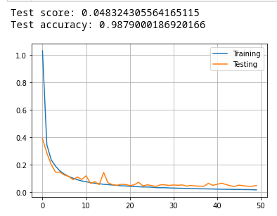

---
title: "ARN - Report - Labo04" 

author: 
- Anthony Coke
- Guilain Mbayo
- Mehdi Salhi
date : \today
titlepage: true
logo: figures/logo.png
toc: true
toc-own-page: true
...

# Learning algorithm 
> 1. What is the learning algorithm being used to optimize the weights of the neural
networks? What are the parameters (arguments) being used by that algorithm? What
cost function is being used ? please, give the equation(s)

> MLP_from_raw_data.ipynb

The algorithm used is RMSprop. 

The arguments used by this algorithm are:
- Learning rate
A Tensor, floating point value, or a schedule that is a tf.keras.optimizers.schedules.LearningRateSchedule, or a callable that takes no arguments and returns the actual value to use. The learning rate. Defaults to 0.001.
- rho:
Discounting factor for the history/coming gradient. Defaults to 0.9.
- momentum:
A scalar or a scalar Tensor. Defaults to 0.0.
- epsilon:
A small constant for numerical stability. This epsilon is "epsilon hat" in the Kingma and Ba paper (in the formula just before Section 2.1), not the epsilon in Algorithm 1 of the paper. Defaults to 1e-7.
- centered:
Boolean. If True, gradients are normalized by the estimated variance of the gradient; if False, by the uncentered second moment. Setting this to True may help with training, but is slightly more expensive in terms of computation and memory. Defaults to False.
- name:
Optional name prefix for the operations created when applying gradients. Defaults to "RMSprop".
- \*\*kwargs:
keyword arguments. Allowed arguments are clipvalue, clipnorm, global_clipnorm. If clipvalue (float) is set, the gradient of each weight is clipped to be no higher than this value. If clipnorm (float) is set, the gradient of each weight is individually clipped so that its norm is no higher than this value. If global_clipnorm (float) is set the gradient of all weights is clipped so that their global norm is no higher than this value.

The used cost function is the categorical crossentropy function. It's equation
is: 

# Model Complexity

> 2. Model complexity: for each experiment (shallow network learning from raw data, shallow
network learning from features, CNN, and Fashion MNIST), select a neural network
topology and describe the inputs, indicate how many are they, and how many outputs.
Compute the number of weights of each model (e.g., how many weights between the
input and the hidden layer, how many weights between each pair of layers, biases, etc..)
and explain how do you get to the total number of weights.

> MLP_from_raw_data.ipynb
Inputs: 784, which are each pixels in a picture
Outputs: 10 classes (numbers between 0 and 9)
Activation function: tanh
Activation function for output layer: softmax
Neurons in hidden layer: 250
Batch size: 4096
Dropout: 0.5
Number of epoch: 150
The model has 784 inputs, 1 hidden layer that contains 250 neurons and 10
outputs. The number of weights between the inputs and the hidden layer is 784 *
750 = 196000. The number of weights between the hidden layer and the outputs is
250 * 10 = 2500. The total number of weights is 198500.

> MLP_from_HOG.ipynb
Inputs: 392
Outputs: 10 classes (numbers between 0 and 9)
Activation function: sigmoïd
Activation function for output layer: softmax
Neurons in hidden layer: 200
Batch size: 1024
pixel per cell: 7
n_orientation: 16
number of epoch: 250 (but we could see that 150 is enough)
Dropout: 0.5
The model has 392 inputs, 1 hidden layer that contains 200 neurons and 10
outputs. The number of weights between the inputs and the hidden layer is 392 *
200 = 78400. The number of weights between the hidden layer and the outputs is
200 * 10 = 2000. The total number of weights is 80400.

> CNN.ipynb

> Fashion_MNIST.ipynb

# Deep Neural Networks

> 3. Do the deep neural networks have much more “capacity” (i.e., do they have more
weights?) than the shallow ones? explain with one example

The deep neural network have more hidden layer than the shallow ones, but it
doesn't necessary mean that it has more neurons in it. For exemple, in this lab
we use 300 neurons in the hidden layer for the shallows network (raw_data and
HOG), against only 25 neurons for the deep one (CNN). The deep neural networks
have more capacity, because they usually need less components to achieve the
same goal or better than a shallow neural network. 
If we compare the weights of each model, the shallow one will have more weight
than the deep one. For exemple, a model with 2 entries, 6 neurons in one hidden
layer and 2 output, we get 2 * 6 + 6 * 2 = 24 links that have each their weight.
For the same model but with 3 hidden layers, we got 2 * 2 + 2 * 2 + 2 * 2 + 2 *
2 = 16 links, and so 16 weights.

# Tests

> 4. Test every notebook for at least three different meaningful cases (e.g., for the MLP
exploiting raw data, test different models varying the number of hidden neurons, for the
feature-based model, test pix_p_cell 4 and 7, and number of orientations or number of
hidden neurons, for the CNN, try different number of neurons in the feed-forward part)
describe the model and present the performance of the system (e.g., plot of the
evolution of the error, final evaluation scores and confusion matrices). Comment the
differences in results. Are there particular digits that are frequently confused?

> MLP_from_raw_data.ipynb

**Model**:

- Activation function: tanh
- Neurons: 300
- Dropout: -
- Batch size: 2048
- Epochs: 150 

{width=50%}

{width=70%}

We first tried to train a model without a dropout. As the graph shows there is a
problem with overfitting. Surprisingly the confusion matrix is not so bad, the
wrong classifications are low, but there are a lot.

**Model**:

- Activation function: tanh
- Neurons: 300           
- Dropout: 0.5
- Batch size: 2048
- Epochs: 150

{width=50%}

{width=70%}

We added a dropout and the result already improved. The gap has decreased but at
the beginning the test set looks too easy. 
The confusion matrix shows higher errors but no number really stands out.

**Model**:

- Activation function: tanh
- Neurons: 250           
- Dropout: 0.5
- Batch size: 4096
- Epochs: 150

{width=50%}

{width=70%}

With fewer neurons and a batch size of 4096, we get a nice result. The two
curves are really close to each other.
We begin to see numbers with two digits in the confusion matrix. Numbers 4 and 7
are the less good classified.

**Model**:

- Activation function: sigmoid
- Neurons: 250           
- Dropout: 0.5
- Batch size: 4096
- Epochs: 150

{width=50%}

{width=70%}

When changing the activation function to sigmoid the errors drop faster, the
meeting point is similar to the last graph. 
The same numbers (4 and 7) are less good classified with two digits boxes.

**Model**:

- Activation function: tanh
- Neurons: 150           
- Dropout: 0.5
- Batch size: 4096
- Epochs: 150

{width=50%}

{width=70%}

Setting the number of neurons to 150 changes the moment when the two curves
meet. With tanh we see that the testing set is too simple, the testing curve is
always below below the training one. More epochs are needed to find a stable
ground.
Too few neurons is not a good idea, it increases the amount of errors. We can
see numbers up to 22. This model seems to have more difficulty to classify
numbers from 4 to 9.

**Model**:

- Activation function: sigmoid
- Neurons: 150           
- Dropout: 0.5
- Batch size: 4096
- Epochs: 150

{width=50%}

{width=70%}

The result is similar with the sigmoid function, more epochs are needed to find
the meeting point.
The errors are however less significative than with tanh in the confusion
matrix. 4, 5, 7 and 10 are the only numbers with two digits erros.

## **Conclusion - RAW**
Removing neurons seems to delay the moment when the two curves meet. We didn't
find a model that stands out. Some models have a good graph, but some numbers
have a 1-2% error in the confusion matrix. When computing the f1_score we
obtained most of the time a score around 0.95 which is good. But this score
doesn't really represent the model's behavior. Sometimes the graph clearly shows
an overfitting but the f1_score is 0.97. So when chosing a model we should take
everything into account, the graph, the f1-score, the confusion matrix.

> MLP_from_HOG.ipynb

**Model**:

- Activation function: relu
- Neurons: 200
- Batch size: 512
- Dropout: 0.5
- Epochs: 100
- Pixels: 4
- Orientations: 8

{width=50%}

{width=70%}

We tried to use the preconfigured model but with a batch size of 512 so it could
go faster. The scores are not so bad, but the graph shows some overfitting
starting from 10 epochs. 
The confusion matrix shows that number 3 is often assimilated as a 5 and number
5 as a 3. Those are the only values that strike out.

**Model**:

- Activation function: sigmoid
- Neurons: 200
- Batch size: 512
- Dropout: 0.5
- Epochs: 100
- Pixels: 4
- Orientations: 8

{width=50%}

{width=70%}

We decided to try different activation functions with the preconfigured model.
This one shows the sigmoid function. As we can see this one behaves better than
the previous and there's almost no overfitting. However we can see that the
testing error is below the testing error until around 50 epochs which might
signify that the test set is a little bit too easy.
The confusion matrix doesn't indicate any abnormalities.

**Model**:

- Activation function: tanh
- Neurons: 200
- Batch size: 512
- Dropout: 0.5
- Epochs: 100
- Pixels: 7
- Orientations: 8

{width=50%}

{width=70%}

Those previous attempts where done with 4 pixels, we also tried 7 pixels. This
example with the tanh function clearly depicts a test set that is too easy. The
testing curves never overlaps the testing one. We notice that the test score is
really bad compared to the previous models.
Of course the confusion matrix shows a similar result. This model doesn't seem
to recognize the numbers between 2 and 9. In some cases we can see up to 35
wrong classification in one box.

**Model**:

- Activation function: sigmoid
- Neurons: 200
- Batch size: 512
- Dropout: 0.5
- Epochs: 250
- Pixels: 7
- Orientations: 8

{width=50%}

{width=70%}

By changing the activation function to sigmoid we see a clear improvment with a
slightly lower score.
The confusion matrix also improved, but those numbers are still too high. We can
actually see a value of 30 which is not good.

**Model**:

- Activation function: tanh
- Neurons: 200
- Batch size: 1024
- Dropout: 0.5
- Epochs: 250
- Pixels: 7
- Orientations: 8

{width=50%}

{width=70%}

We tried to increase the batch size which improved the curve for tanh activation
function and lowered the gap between the two curves. The test set looks still
too easy for the model.
The confusion matrix shows really bad results. Numbers from 2 to 9
classification generates many erros. 

**Model**:

- Activation function: sigmoid
- Neurons: 200
- Batch size: 1024
- Dropout: 0.5
- Epochs: 250
- Pixels: 7
- Orientations: 8

{width=50%}

{width=70%}

With the sigmoid function the results are the same.

**Model**:

- Activation function: tanh
- Neurons: 200
- Batch size: 1024
- Dropout: 0.5
- Epochs: 200
- Pixels: 7
- Orientations: 16

{width=50%}

{width=70%}

Changing the number of orientations to 16 changed the curves with tanh function.
It looks like a really good model because the curves are overlapping the entire
time.
Again, the confusion matrix shows something we couldn't see with the graph. This
model is not really good at predicting what number it sees.

**Model**:

- Activation function: relu
- Neurons: 150
- Batch size: 1024
- Dropout: 0.5
- Epochs: 200
- Pixels: 7
- Orientations: 8

{width=50%}

{width=70%}

## **Conclusion - HOG**
We performed various tests and modified every parameter, we didn't find the
perfect model. As we can see in most confusion matrices, the models tend to have
difficulties with classifying numbers between 2 and 9. We see some values that
stick out, such as 10, 22, 30, etc. The model {sigmoid, 200 neurons, 512 batch
size, 0.5 dropout, 4 pixels, 9 orientations, 100 epochs} is quiet good and it
has the lowest amount of wrong classifications. The two curves meet at around 50
epochs which is pretty early compared to ther other ones. In every graph we can see that
the test curve is always below the training one. This shows that the test set
might be too easy. The f1_scores we computed were good and around 0.95. As
stated in the RAW part, we think the f1_score is not sufficient to determine if
a model is good.

> CNN.ipynb

**Model**:

- L4 neurons: 25
- L4 activation function: Relu
- Batch size: 2048
- Epochs: 50

{width=50%}

{width=70%}

As we can see, the results with this preconfigured model are not that bad. The
score is low and the accuracy is close to 1.0. However, from 10 epochs this
model slowly starts to overfit. We can clearly see the gap between the training
error and the testing error increases as we continue to iterate through the
epochs.

**Model**:

- L4 neurons: 10                                        
- L4 activation function: Relu
- Batch size: 2048
- Epochs: 50

{width=50%}

{width=70%}

We tried to decrease the number of neurons in the L4 layer. The scores are quiet
similar to the previous model, but the testing error fluctuates more especially
from the start to around 25 epochs. There's still a small overfitting but the
curves seem to be stable. 

**Model**:

- L4 neurons: 5                                        
- L4 activation function: Relu
- Batch size: 2048
- Epochs: 50

{width=50%}

{width=70%}

Here we tried an extremly low number of neurons in the L4 layer. The result is
pretty good. The score is a little bit higher than the first model tested, but
the two curves are almost overlapping the entire time. It looks like a good
model.
The confusion matrix shows that the number 4, 5 and 9 are quiet often wrongly
classified.

**Model**:

- L4 neurons: 35                                        
- L4 activation function: Relu
- Batch size: 2048
- Epochs: 50

{width=50%}

{width=70%}

We then chose a high number of neurons to see how the model reacts. It's
definitely not a good model and 35 neurons is probably a bit to much for this
task. There's an overfitting starting at 20 epochs. Surprisingly (or not),
despite our bad curves the accuracy is the best we've had.
The confusion matrix doesn't show a lot, the classification is not so bad.

**Model**:

- L4 neurons: 25                                        
- L4 activation function: tanh
- Batch size: 2048
- Epochs: 50

{width=50%}

We also wanted to see how the preconfigured model would behave when changing the
activation function in layer 4. This one uses tanh and we can clearly see it
overfits directly at 10 epochs, maybe it's just bad luck and after tweaking some
parameters it will probably show something good, but we didn't try since we were
told just to change the number of neurons in the feed-forward part.

**Model**:

- L4 neurons: 25                                        
- L4 activation function: sigmoid
- Batch size: 2048
- Epochs: 50

{width=50%}

With sigmoid the score is really low, the accuracy close to 1.0 and the curves
are overlapping. After 20 epochs the testing error looks like it is going away a
bit, but the gap is still really small after 50 epochs.
The confusion matrix doesn't show abnormalities, there are few errors here and
there, but nothing out of the ordinary.

##**Conclusion - CNN**
As we can see lowering the number of neurons in L4 helped
us reduce the gap between the testing and training curves with relu activation
function. However, when reaching really low numbers like 5, the 
really low numbers of neurons, the confusion matrix shows something pretty
different that the plot. Some numbers are not classified properly such as 4,5
and 9. Sometimes it represents 1-2% of the predictions for one particular numbers. It's not a big
deal, but if we need to be really precise, this result is note enough. Other
than that the digits are globally correctly classified even when changing the
activation function. The f1_score we computed were around 0.95 with sometimes
values up to 0.99.

