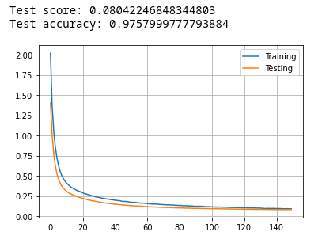

---
title: "ARN - Report - Labo04" 

author: 
- Anthony Coke
- Guilain Mbayo
- Mehdi Salhi
date : \today
titlepage: true
logo: figures/logo.png
toc: true
toc-own-page: true
...

# Learning algorithm 

> 1. What is the learning algorithm being used to optimize the weights of the neural
networks? What are the parameters (arguments) being used by that algorithm? What
cost function is being used ? please, give the equation(s)

> MLP_from_raw_data.ipynb

The algorithm used is RMSprop. 

The arguments used by this algorithm are:
- Learning rate
A Tensor, floating point value, or a schedule that is a tf.keras.optimizers.schedules.LearningRateSchedule, or a callable that takes no arguments and returns the actual value to use. The learning rate. Defaults to 0.001.
- rho:
Discounting factor for the history/coming gradient. Defaults to 0.9.
- momentum:
A scalar or a scalar Tensor. Defaults to 0.0.
- epsilon:
A small constant for numerical stability. This epsilon is "epsilon hat" in the Kingma and Ba paper (in the formula just before Section 2.1), not the epsilon in Algorithm 1 of the paper. Defaults to 1e-7.
- centered:
Boolean. If True, gradients are normalized by the estimated variance of the gradient; if False, by the uncentered second moment. Setting this to True may help with training, but is slightly more expensive in terms of computation and memory. Defaults to False.
- name:
Optional name prefix for the operations created when applying gradients. Defaults to "RMSprop".
- \*\*kwargs:
keyword arguments. Allowed arguments are clipvalue, clipnorm, global_clipnorm. If clipvalue (float) is set, the gradient of each weight is clipped to be no higher than this value. If clipnorm (float) is set, the gradient of each weight is individually clipped so that its norm is no higher than this value. If global_clipnorm (float) is set the gradient of all weights is clipped so that their global norm is no higher than this value.

The used cost function is the categorical crossentropy function. It's equation
is: 

# Model Complexity

> 2. Model complexity: for each experiment (shallow network learning from raw data, shallow
network learning from features, CNN, and Fashion MNIST), select a neural network
topology and describe the inputs, indicate how many are they, and how many outputs.
Compute the number of weights of each model (e.g., how many weights between the
input and the hidden layer, how many weights between each pair of layers, biases, etc..)
and explain how do you get to the total number of weights.

> MLP_from_raw_data.ipynb
Inputs:
Outputs: 
Activation function: tanh
Activation function for output layer: softmax
Neurons in hidden layer: 250
Batch size: 4096
Dropout: 0.5
Number of epoch: 150

> MLP_from_HOG.ipynb

> CNN.ipynb

> Fashion_MNIST.ipynb

# Deep Neural Networks

> 3. Do the deep neural networks have much more “capacity” (i.e., do they have more
weights?) than the shallow ones? explain with one example

The deep neural network have more hidden layer than the shallow ones, but it
doesn't necessary mean that it has more neurons in it. For exemple, in this lab
we use 300 neurons in the hidden layer for the shallows network (raw_data and
HOG), against only 25 neurons for the deep one (CNN). The deep neural networks
have more capacity, because they usually need less components to achieve the
same goal or better than a shallow neural network. 
If we compare the weights of each model, the shallow one will have more weight
than the deep one. For exemple, a model with 2 entries, 6 neurons in one hidden
layer and 2 output, we get 2 * 6 + 6 * 2 = 24 links that have each their weight.
For the same model but with 3 hidden layers, we got 2 * 2 + 2 * 2 + 2 * 2 + 2 *
2 = 16 links, and so 16 weights.

# Tests

> 4. Test every notebook for at least three different meaningful cases (e.g., for the MLP
exploiting raw data, test different models varying the number of hidden neurons, for the
feature-based model, test pix_p_cell 4 and 7, and number of orientations or number of
hidden neurons, for the CNN, try different number of neurons in the feed-forward part)
describe the model and present the performance of the system (e.g., plot of the
evolution of the error, final evaluation scores and confusion matrices). Comment the
differences in results. Are there particular digits that are frequently confused?

> MLP_from_raw_data.ipynb

{width=50%}

{width=50%}

We can see in this experiment that there's clearly an overfitting. 

{width=50%}

{width=50%}

{width=50%}

{width=50%}

{width=50%}

{width=50%}

{width=50%}

{width=50%}

{width=50%}

{width=50%}

{width=50%}

{width=50%}

{width=50%}

{width=50%}

{width=50%}

> MLP_from_HOG.ipynb

{width=50%}

{width=50%}

{width=50%}

{width=50%}

{width=50%}

{width=50%}

{width=50%}

{width=50%}

{width=50%}

{width=50%}

{width=50%}

{width=50%}

{width=50%}

{width=50%}

{width=50%}

{width=50%}

{width=50%}

{width=50%}

{width=50%}

{width=50%}

{width=50%}

{width=50%}

{width=50%}

{width=50%}

{width=50%}

{width=50%}

{width=50%}

{width=50%}

{width=50%}

> CNN.ipynb

{width=50%}

{width=50%}

{width=50%}

{width=50%}

{width=50%}

{width=50%}

{width=50%}

{width=50%}

{width=50%}

{width=50%}

{width=50%}

