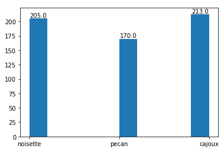
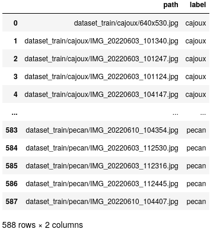
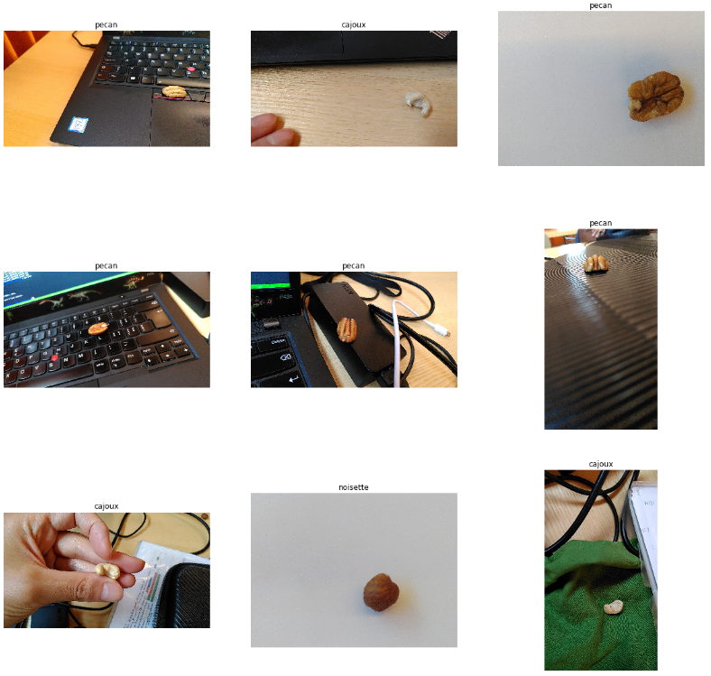
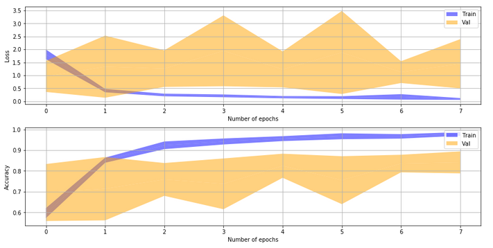
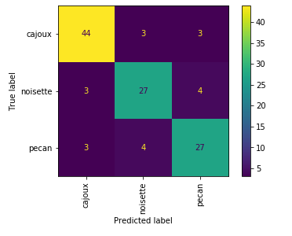
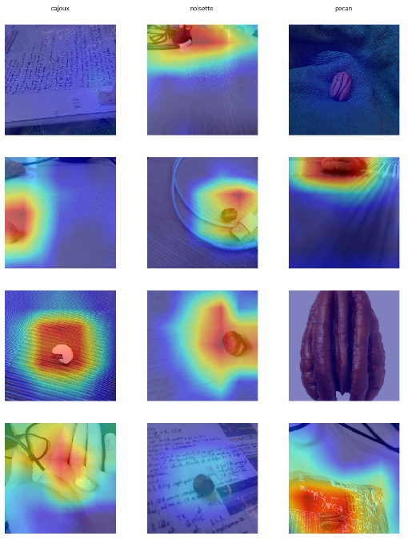
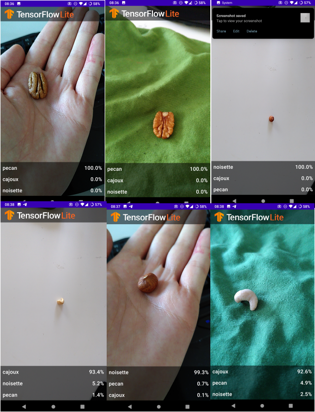
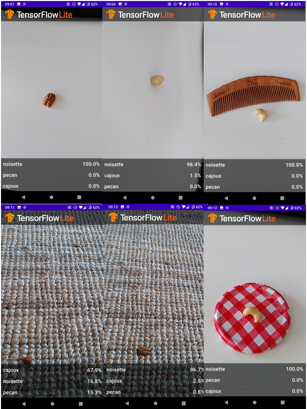

---
title: "ARN - Laboratory 05" 

author: 
- Anthony Coke
- Mehdi Salhi
- Guilain Mbayo
date : \today
titlepage: true
logo: figures/logo.png
toc: true
toc-own-page: true
...

# Introduction

> describe the context of your application and its potential uses, briefly describe
how you are going to proceed (methodology), that is, what data are you going to collect (your
own pictures of.... , maybe extra-pictures collected from the web, etc), what methods are you
going to use (e.g., CNNs, transfer learning)


Our application is made in the context of the course ARN (Apprentissage par
réseau de neurone) At the HEIG-VD.
Its goal is to classify different types of nuts.
In order to achieve this goal, we decided to take several pictures of cashew
nuts, hazelnuts, and pecans with various backgrounds, various specimens and various angles. 
Depending on the result, we will then eventually add pictures from the web.

We will use MobileNet V2, which is a pre-trained convolutionnal network. We will
then add some layers and train them to our specific application.

Our application could be used for various purpose. For example, allow users to
identify different nuts, for allergy purpose. This could also be used for
industrial application when sorting nuts or detecting allergens in food or even
better, an app on social media that tells you what sort of nut you are !

# The problem

> describe what are the classes you are learning to detect using a CNN, describe the
database you collected, show the number of images per class or a histogram of classes (is it a
balanced or an unbalanced dataset? Small or big Data ?) and provide some examples showing
the intra-class diversity and the apparent difficulty for providing a solution (inter-class
similarity).

The problem is to be able to identify and differentiate between 3 sorts of nuts:
pecan, hazelnuts and cashews, using a camera on a portable device.



Our dataset contains around 200 pictures of cashew nuts, 200 hazelnuts and
around 170 pecan pictures. It can be considered as Small Data compared to
ImageNet which has 1000 images per category.

We tried to change the background behind the nuts to add more variations but
also to increase intra-class diversity. We wanted to avoid that the model learns
only the background to determine the type of nut in the picture. We used the
same backgrounds for each nut so the main difficulty of the model will be to
find the features that will help him differentiate the nuts. We hoped it would
concentrate on the details of the nut.

 

# Dataset and Data preparation

We took photos of the different nuts on various backgrounds (color, texture) with
various angles and zooms without our smartphones. Our dataset consist of 587 
images of pecans, cashews and hazlenuts. We were careful to take pictures that
would represent the final condition best, that is, trying to identify a nut with a
mobile device.





We had to take more and more pictures because our first dataset had too much of
the same background. Our final dataset consist of close-up pictures of the nuts
with a "neutral" background so that our model can extract clear features plus
more realistic picture taken at various angles and backgrounds so that it does
not overfit and can work better in realistic conditions.

Our whole images dataset is rescaled and resized in order to always give the
same dimensions as input for our model.
In order to have slightly different images at each iteration, we applied some
data augmentations to our training set. It include RandomFlip, RandomZoom,
RandomRotation and RandomContrast. We chose to use value between -0.2 and 0.3
and not higher because we saw that the resultant pictures were too deformed, and
thus could maybe mislead our model.

We used the provided code to train, test and validate our model with KFold.

# Model creation

In order to find our model, we proceeded the same way as for all the precedent labs: trying something
and then fine tune until we get acceptable results (plot, confusion matrix, etc...).

We had issues finding the right model. Our results were sometimes good with the train set and validation set but then 
terrible with the app on the mobile device. It was also confusing to find the right parameters and layers configurations. 
Adding layer or neuron seemed to just make things worse, as did removing layers or neurons.


> a. What hyperparameters did you choose (nb epochs, optimizer, learning rate, ...) ?


> b. What is the architecture of your final model ? How many trainable parameters does it
have?


> c. How did you perform the transfer learning ? Explain why did you use transfer learning,
e.g., what is the advantage of using transfer learning for this problem and why it might
help ?

Transfert learning is extremely valuable as it allows us to leverage the power of another model that is already trained. 
We are using MobileNet V2, a convolutional network optimised for mobile devices. The first layers are the pre-trained 
layers of MobileNet on top of which we add our layers which are the only one that are being trained. Transfer learning 
works because many layers do the same things on any model, that is, extracting low level features (for example edges), 
and medium level features (for example shapes) which are common to any images. Without transfer learning, we would have 
to train our model every time for this same task.


We tried a lot of different variation. We started with very simple architectures
like a single layer of 20 neurons, 2 layers, 3 layers. We also tried 250
neurons, adding dropout, modifying out data augmentation but our model was still
bad in realistic condition. With the previous labs, we were used to have very
simple architectures and a small number of neurons but this task is much more
complex. We searched the web for examples and common settings for image
classification and found out that using thousands of neurons was more common for
such a task. We tried adding 2 layers with 1024 neurons each and a third layer
with 512 neurons. The graph of the results wasn't too good as you can see below,
but our confusion seemed to indicate that the classification was ok.





Our grad-cam also indicated that the model was able to find the nuts and was
activated by them.



So we loaded our model on our phones and tried in realistic conditions. It was
the first time the results were good using our phones.

{width=80%}

Still, our model is very easy to trick by changing the angle or the background.

{width=80%}

## Parameters

Final model :

```
Total params: 5,145,667
Trainable params: 3,299,843
Non-trainable params: 1,845,824

```

Our final model consist of the frozen MobileNetV2 layers plus the 4th last layers 
we added :

- Dense(1024, activation='relu')
- Dense(1024, activation='relu')
- Dense(512, activation='relu'),
- Dense(len(LABEL_NAMES), activation='softmax')


# Results

##TODO: screenshots, confusion matrix, etc

> a. Provide your plots and confusion matrices


> b. Provide the f-score you obtain for each of your classes.

> c. Provide the results you have after evaluating your model on the test set. 
Comment if the performance on the test set is close to the validation 
performance. What about the performance of the system in the real world ?

> d. Present an analysis of the relevance of the trained system using the Class Activation
Map methods (grad-cam)

> e. Provide some of your misclassified images (test set and real-world tests) and comment
those errors.

> f. Based on your results how could you improve your dataset ?

Various solutions :

- Using more data augmentation
- Taking more photos
- Enriching our dataset with pictures from the web


> g. Observe which classes are confused. Does it surprise you? In your opinion, what can
cause those confusions ? What happens when you use your embedded system to
recognize objects that don’t belong to any classes in your dataset ? How does your
system work if your object is placed in a different background ?


# Conclusion

We tried several configurations for our model (1 layer, 2 layers, 3 layers, 256
neurons, 8 neurons, dropout, etc...) and most of the time, we managed to get
high accuracies and fine confusion matrix. But even so, we had problems once our
model loaded on the app. Indeed, the app detected each classes with great
confidence, but not for the right nut. 
We believe that our model is too influenced by the background due to a to
different images set between our 3 classes.
TODO: ARN IS FUN


> finalize your report with some conclusions, summarize your results, mention the
limits of your system and potential future work
